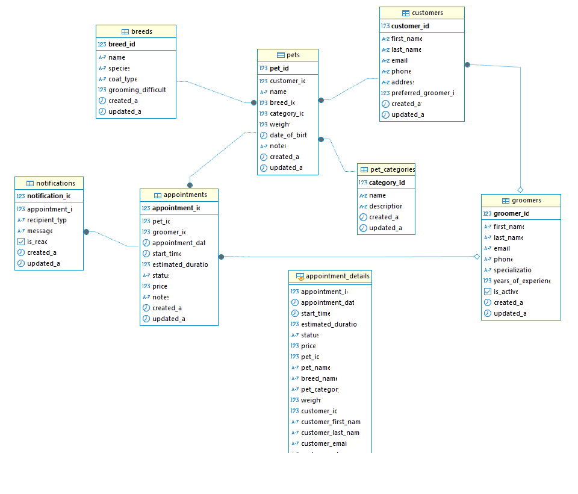

# Book Pet Grooming API 🐾

<p align="center">
  
</p>

  <p align="center">Technologies used.</p>
    <p align="center">
<a href="https://dotnet.microsoft.com/en-us/" target="_blank"></a>
<a href="https://learn.microsoft.com/en-us/aspnet/core/" target="_blank"></a>
<a href="https://docs.microsoft.com/en-us/ef/core/" target="_blank"></a>
<a href="https://github.com/jbogard/MediatR" target="_blank"></a>
<a href="https://fluentvalidation.net/" target="_blank"></a>
<a href="https://automapper.org/" target="_blank"></a>
<a href="https://serilog.net/" target="_blank"></a>
<a href="https://swagger.io/" target="_blank"></a>
<a href="https://xunit.net/" target="_blank"></a>
<a href="https://github.com/moq/moq4" target="_blank"></a>
<a href="https://fluentassertions.com/" target="_blank"></a>
<a href="https://www.microsoft.com/sql-server" target="_blank"></a>
<a href="https://github.com/danielpalme/ReportGenerator" target="_blank"></a>
<a href="https://marketplace.visualstudio.com/items?itemName=ryanluker.vscode-coverage-gutters" target="_blank"></a>
<a href="https://github.com/RicoSuter/NSwag" target="_blank"></a>
</p>


## Description📍

Services for scheduling grooming for your pets at your trusted salon.

# Professional .NET Application Structure 🏗️

This project implements a layered architecture following the principles of Clean Architecture and Domain-Driven Design (DDD).

## Project Structure 🗂️

```
Solution 'BookPetGroomingAPI'
├── src/
│   ├── BookPetGroomingAPI.API                 # Presentation Layer - REST API
│   ├── BookPetGroomingAPI.Application         # Application Layer - Use Cases
│   ├── BookPetGroomingAPI.Domain              # Domain Layer - Entities and Business Rules
│   ├── BookPetGroomingAPI.Infrastructure      # Infrastructure Layer - Concrete Implementations
│   └── BookPetGroomingAPI.Shared              # Shared Components Across Layers
├── tests/
│   ├── BookPetGroomingAPI.UnitTests           # Unit Tests
│   ├── BookPetGroomingAPI.IntegrationTests    # Integration Tests
│   └── BookPetGroomingAPI.FunctionalTests     # Functional Tests
```

## Application Layers 🧩

### Domain Layer (BookPetGroomingAPI.Domain) 🏛️
Contains business entities, repository interfaces, domain events, and business rules. This layer is independent of any external framework or technology.

### Application Layer (BookPetGroomingAPI.Application) ⚙️
Contains application logic and orchestration. Implements use cases that coordinate the flow of data to and from domain entities, and directs those entities to use their business rules to achieve the objectives of the use case.

### Infrastructure Layer (BookPetGroomingAPI.Infrastructure) 🏗️
Contains concrete implementations of interfaces defined in the domain and application layers. Includes data access, external services, logging, etc.

### Presentation Layer (BookPetGroomingAPI.API) 🌐
Exposes the application's functionality through a REST API. Handles HTTP requests, input validation, and response serialization.

### Shared Components (BookPetGroomingAPI.Shared) 🔗
Contains components, utilities, and models that are shared across multiple layers.

## Implemented Patterns 🧩

- **Repository Pattern**: To abstract data access
- **Mediator Pattern (CQRS)**: To separate read and write operations
- **Unit of Work**: To manage transactions
- **Dependency Injection**: To decouple components
- **Options Pattern**: To manage configuration
- **Specification Pattern**: For complex queries
- **Validation Pattern**: For data validation
- **Logging**: To track application events and errors
- **Error Handling**: To provide meaningful error messages
- **API Versioning**: To support multiple versions of the API

## Database Schema 📚

Below is our database schema diagram showing the relationships between tables:

<p align="center">
  
</p>

## SQL Scripts 💡

You can find the database initialization and setup scripts in the `database/schema-sqlserver.sql` file. This script contains:

- Database creation
- Table creation statements
- Initial data seeding
- Stored procedures and functions
- Database indexes and constraints

To set up your database, execute the SQL Server script in the following order:
1. Ensure you have appropriate permissions on your SQL Server instance
2. Execute the complete script using SQL Server Management Studio or your preferred SQL tool
3. Verify the database and its objects are created successfully

## Installation 📦

To install and run the project, follow these steps:

1. Clone the repository
```bash
git clone https://github.com/desobsesor/book-pet-grooming-api.git
```
2. Run the maven command
```bash
mvn clean install
```
3. Run the application
```bash
dotnet run --project src/BookPetGroomingAPI.API/BookPetGroomingAPI.API.csproj
```
## Testing 🧪
To run the tests, execute the following command:
```bash
dotnet test tests/BookPetGroomingAPI.UnitTests/BookPetGroomingAPI.UnitTests.csproj
```

<h2>Test Coverage Guide</h2>
<p>For detailed instructions on how to execute and interpret test coverage, please refer to the <a href="./docs/guides/test-coverage-guide.md">Test Coverage Guide</a>.</p>


## Built with 🛠️

_Tools and Technologies used_

- [.NET 8](https://dotnet.microsoft.com/en-us/) - Development platform for modern, high-performance applications
- [ASP.NET Core](https://learn.microsoft.com/en-us/aspnet/core/) - Framework for building RESTful APIs and web applications
- [Entity Framework Core](https://docs.microsoft.com/en-us/ef/core/) - Modern ORM for SQL Server database access
- [SQL Server](https://www.microsoft.com/en-us/sql-server) - Enterprise-grade relational database management system
- [MediatR](https://github.com/jbogard/MediatR) - Mediator pattern implementation for CQRS
- [FluentValidation](https://fluentvalidation.net/) - Model and business rules validation
- [AutoMapper](https://automapper.org/) - Object-to-object mapping
- [Serilog](https://serilog.net/) - Structured logging
- [Swagger/OpenAPI](https://swagger.io/) - Interactive API documentation
- [xUnit](https://xunit.net/) - Unit testing framework
- [Moq](https://github.com/moq/moq4) - Mocking framework for tests
- [FluentAssertions](https://fluentassertions.com/) - Expressive assertions for tests

## Versioned 📌

[SemVer](http://semver.org/) is used for versioning. For all versions available.

## Documentation 📖

http://localhost:5000/swagger/index.html

## Author ✒️

_Built by_

- **Yovany Suárez Silva** - _Full Stack Software Engineer_ - [desobsesor](https://github.com/desobsesor)
- Website - [https://portfolio.cds.net.co](https://desobsesor.github.io/portfolio-web/)


## License 📄

This project is under the MIT License - see the file [LICENSE.md](LICENSE.md) for details
